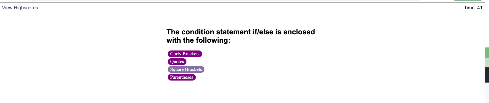
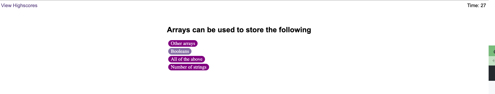
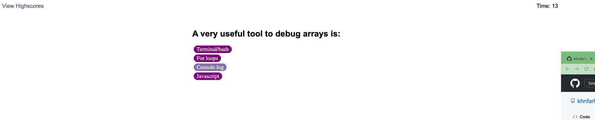
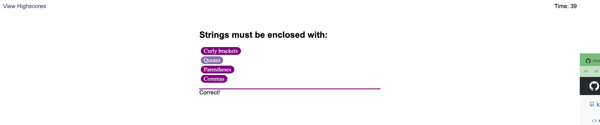
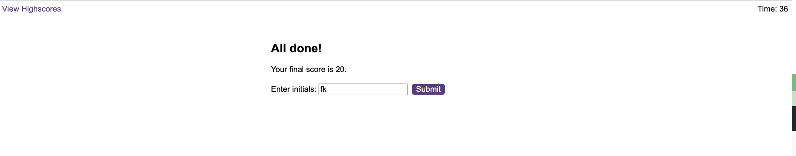
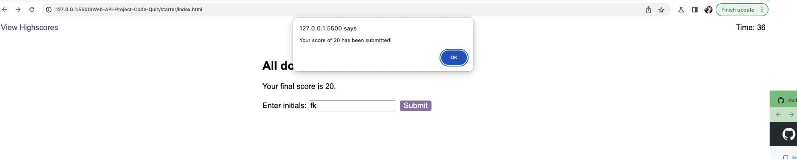
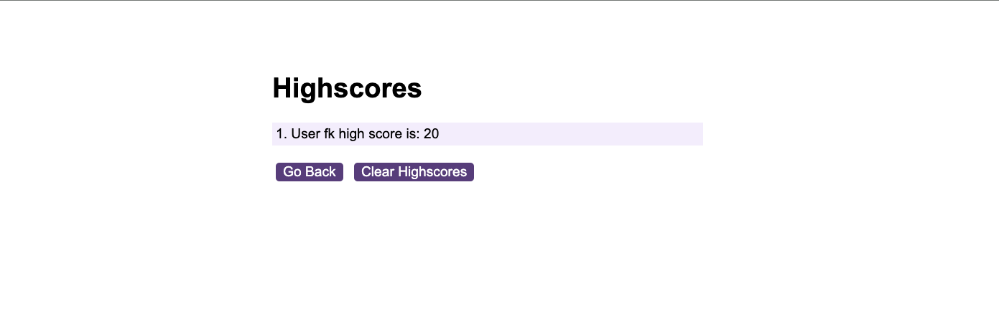

# Web-API-Project-Code-Quiz
Coding quiz showing question with multiple anwers. If we select right answer than score will +10 and if we will give wrong answer then timer will be -10second reduce. 

# A start button that when clicked a timer starts and the first question appears.

# When the game ends, it should display their score and give the user the ability to save their initials and their score
# coding quiz screenshots:

