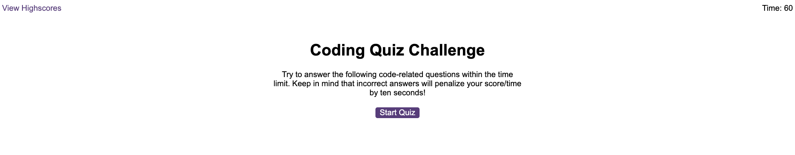

# Working with Web APIs: Code Quiz
Challenge 6 : In this Challenge, create a timed, multiple-choice coding quiz that can keep track of high scores and quiz-takers' initials.

# Project Requirements:
 * GIVEN I am taking a code quiz
 * WHEN I click the start button
 * THEN a timer starts and I am presented with a question
 * WHEN I answer a question
 * THEN I am presented with another question
 * WHEN I answer a question incorrectly
 * THEN time is subtracted from the clock
 * WHEN all questions are answered or the timer reaches 0
 * THEN the game is over
 * WHEN the game is over
 * THEN I can save my initials and score

# Description of this Project:
  User story of this project:
   * AS A coding boot camp student-
   * I WANT to take a timed quiz on JavaScript fundamentals that stores high scores-
   * SO THAT I can gauge my progress compared to my peers

   We need to write a timed coding quiz with multiple-choice questions. When the user has finished the quiz or the time was over then the user should be able to save their initials and score to a high scores table.

   Coding quiz showing question with multiple anwers. If we select right answer than score will +10 and if we will give wrong answer then timer will be -10second reduce. 

# Technologies Used:
 * HTML
 * CSS
 * Javascript

# Image Links of this Project:
 * A start button that when clicked a timer starts and the first question appears.
 

 * First question appears when start button appears
 

# Video Link of this Project:

 # Application GitHub URL:
https://github.com/khnfarha1987/Web-API-Project-Code-Quiz

# Application Deployed live URL:
https://khnfarha1987.github.io/Web-API-Project-Code-Quiz/

